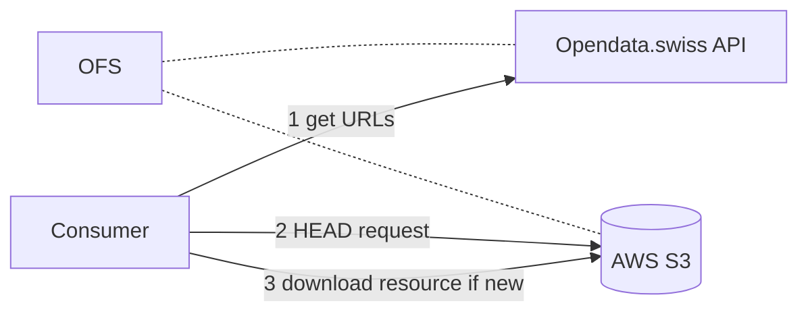
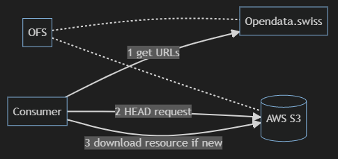

### Intro
Description and examples of how to use the APIs to access data for the 2023 federal elections.\

The main problem is that the `real-time' files can become pretty big and if many people access them too often just to check if they have been updated, the system is likely to slow down considerably. Moreover, in the unlikely event of a server or network failure, we would switch to a fallback solution, so the URLs of the resource must be up to date on your side. We recommend using the principle below to mitigate these risks.

\

#### API Endpoints

| Environment | Endpoint URL | Use |
| - | - | - | 
| Test | https://ckan.ogdch-abnahme.clients.liip.ch/api/3/action/package_show?id=eidg-wahlen-2023 | Tests before election Sunday | 
| Production | https://ckan.opendata.swiss/api/3/action/package_show?id=eidg-wahlen-2023 | Lists and candidates before Sunday + results on Sunday starting 12:00 CET |


### Basic Principle





1. **The consumer gets the URL(s) of the resource(s) from opendata.swiss API.**<br/>
This ensures that the URLS are up to date. In the unlikely case of a system failure of the AWS S3 bucket, the FSO will switch to a fallback server and update the URLS in the API.
2. **The consumer makes a HEAD request on the resource server.**<br/>
This allows the detection of changes without downloading the entire file, by checking the `Last-Modified` header. Example with curl (*Another example using Python is available below.*)
```shell
$ curl -I https://ogd-dev-static.voteinfo-app.ch/v4/ogd/sd-t-17.02-NRW2023-kandidierende.json 

HTTP/1.1 200 OK
x-amz-id-2: tpS9Gu0RLuMZbRDwvNEa8qKW2NQBPBm8vYKRf5E+4b9PRS9MNmC/YZBgUDagmw1s172evjx3z64=
x-amz-request-id: Z1T8XB7DNKMZTSDX
Date: Mon, 21 Aug 2023 08:45:52 GMT
Last-Modified: Wed, 16 Aug 2023 14:58:29 GMT
ETag: "811dca5203b626b70e83b79191a760ad"
x-amz-server-side-encryption: AES256
x-amz-meta-minimum-api-version: 32
Accept-Ranges: bytes
Content-Type: application/json
Server: AmazonS3
Content-Length: 3231927
```
3. **The consumer downloads the resource (only if it has been updated).**

\

### Example Code (Python)

An example of how to use the Opendata.swiss API to retrieve the resource URLs and then check if a resource has been updated without downloading it based on the principle above is available on our GitHub: https://github.com/bfspoku/ogd-demo

Feel free to use, modify or redistribute the code.

\

### Limitations

HEAD Request works only on HTTP servers or end points where the `Last-Modified` header is returned. This won't work with services like the FSO DAM that is a Tomcat web app and returns data directly from a DB without `Last-Modified`. If you see any link looking like 
https://dam-api.bfs.admin.ch/hub/api/dam/assets/26965404/master, it won't be applicable.
